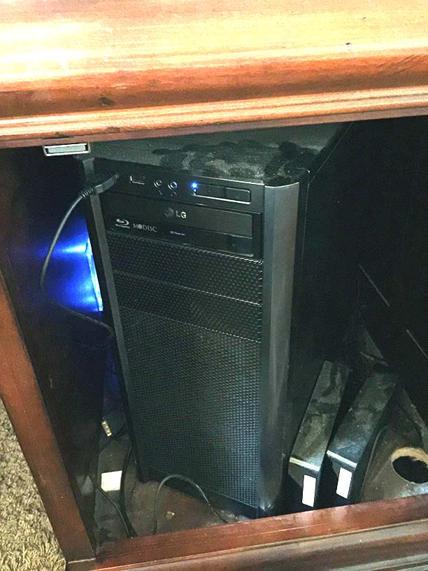
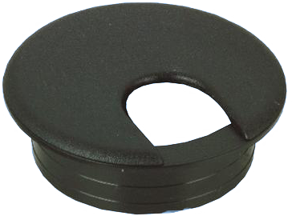
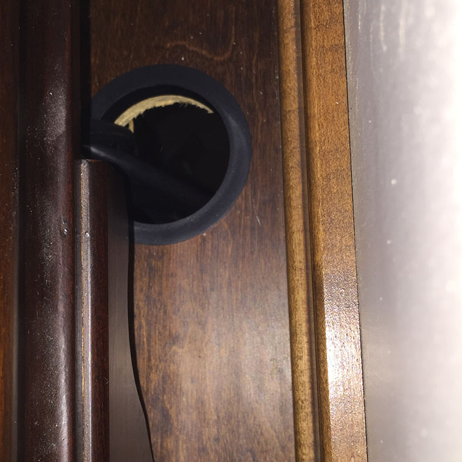
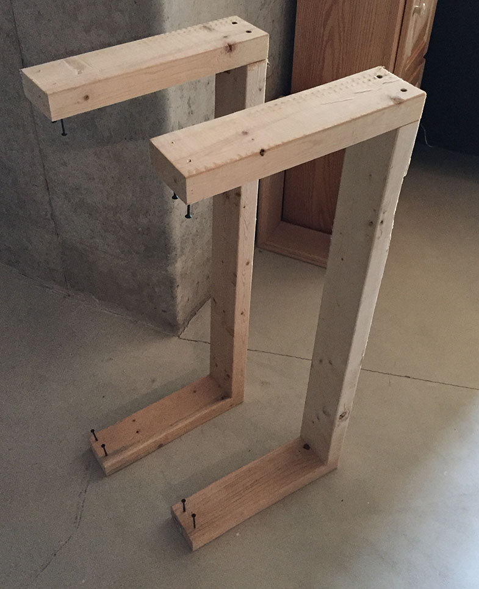
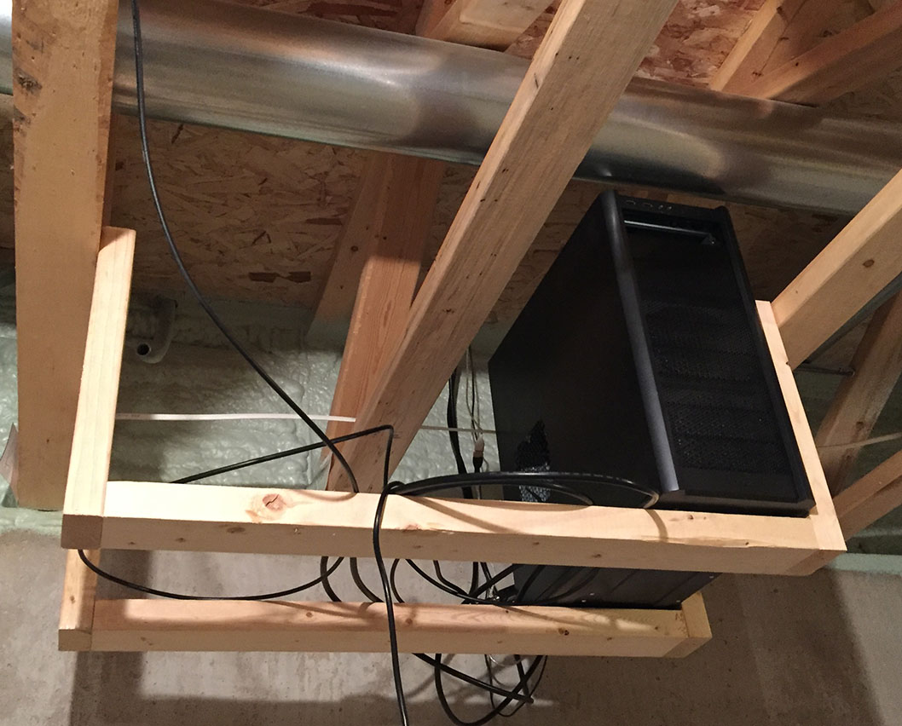
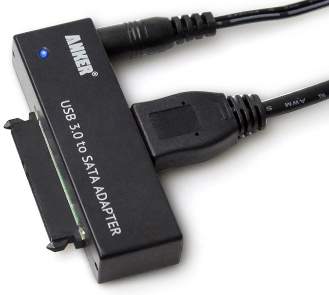
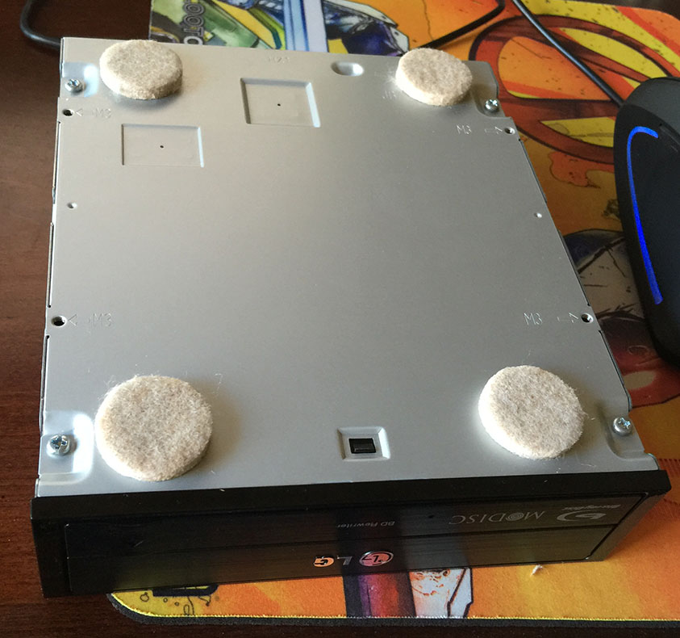
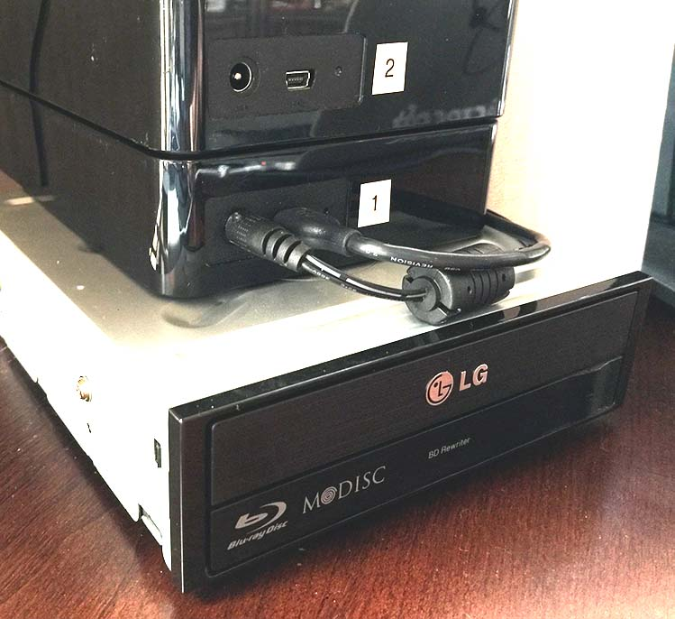

Most computers generate a lot of noise and heat. A few months ago, coincidentially the middle of summer, I realized I could move my PC into the basement and solve both of these problems.

Here is a photo of my tower in my desk:

It's pretty dusty, and since it's in a fairly enclosed area, it runs hotter than it should. My original solution was to add a fan to the desk, and drill holes to allow the air to flow through. Unfortunately, this turns my desk into a giant room heater.

Originally I planned on running the cables through the wall down to the basement, but the DVI cables have large ends, and I didn't want to remove much insulation from an outside wall. I decided to instead drill a hole in the floor using a standard size used in desks so that it's easy to cover/cap as needed.

This is the type of grommet I picked up:

I used masking tape on the wood floor to avoid splintering, and then used a hole saw to drill a 2.5" hole.

Here is what the finished hole looks like, with the plastic ring dropped (again, the same as what you would use in an office desk) in to make it look nice. It's near the wall so that it's out of the way, and my desk is close enough to the wall to run my cables under the desk into the hole.

Let's head down to the basement.

I built 2 brackets to hang from the floor joists and hold the tower.

Here they are installed with the PC sitting on top. I'm going to put some hooks in for wire management.

### Blu-Ray Drive

One issue with having my PC in a different room is that I can't phsyically access the Blu-Ray drive without going into the basement.

I found a USB 3.0 to SATA adapter that connects to the drive and provides power and a data connection.

I don't want to scratch my desk, so let's add some protection.

Here it is sitting on my desk.

### Other Connections

Not a lot of cables are required for my setup. I have 2 dual-DVI connections, a 3.5mm audio connection, and a couple of [USB extensions](http://www.monoprice.com/search/index?keyword=usb+extension) allowing me to connect a USB hub and other devices.

One suggestion if you're thinking of doing this - run a few USB extensions so that you can directly connect devices like keyboards to the PC. If your keyboard runs through a USB hub, you may run into issues if you need to get into the BIOS since the USB Hub drivers may not work at boot time. I've also seen delays in Windows recognizing the keyboard when connected to a hub.

I keep my PC on 24/7, so accessing the power button isn't important. It's easy enough for me to go into the basement in the rare case where I need to push the button. If you need access to your power button remotely, it would not be overly difficult to run 2 low voltage wires and connect a momentary switch. The power button simply closes a circuit momentarily, so it's easy to extend.

### Conclusion

Even though my setup was extremely quiet before, it's noticably quieter now. We also had some warm days recently and my office stayed nice and cool. I'm happy with the solution so far, and the extra space in my desk was a great place to hide my printer.