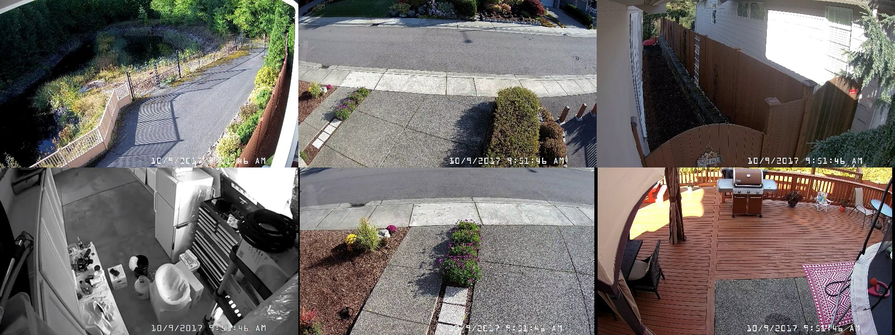

I've gotten a ton of requests for details about my video surveillance system I set up on my house.

I have a view of every side of my house, 24/7. I get alerts on my phone when "interesting" events occur. When I'm away from my house, it gets locked down and I get a different set of alarms on my phone when certain events occur. I can view all of my cameras and recordings from my phone or computer, from anywhere in the world. Even if my server is stolen, I'll have photos of them stealing it.

This how I do it.

## Hardware / Software

What I use:
* [Hikvision 4mp cameras](http://amzn.to/2xun92a)
* [PoE switch](http://amzn.to/2g4utiv)
* [Cat 5e cable](https://www.monoprice.com/search/index?keyword=cat%205&mode=list&category_2=Networking/Cat%205e%20Bulk%20Ethernet%20Cables)
* [Blue Iris software](http://blueirissoftware.com/)

## Wi-Fi vs PoE (wired)

I'm frequently asked why I don't use Wi-Fi cameras. It primarily comes down to the fact that Wi-Fi cameras still need power, and I generally don't have outlets next to where my cameras are.

Wi-Fi Cameras Advantages
* No need to run a cable (but still need *power*!)

PoE (Power over Ethernet) Cameras
* Easier to add a Cat 5 cable in most cases than an outlet
* Doesn't compete for any Wi-Fi bandwidth
* Can't be jammed

## Configuring Blue Iris

What is Blue Iris?

